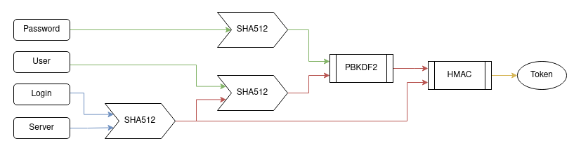

# =T0k3n!z3R=

**Quick & dirty password key derivation tool.**

Inspired by https://spectre.app and https://lesspass.com \
Only one good master password for an infinity of strong unique tokens.\
No subscription - no account - no storage - no leaks - works offline & from terminal

> _« One Ring to rule them all, One Ring to find them, One Ring to bring them all and in the darkness bind them. »_ — J.R.R. Tolkien

```
HOST_HASH = SHA512( LOGIN + SERVER )

USER_HASH = SHA512( USERNAME + HOST_HASH )

PWD_HASH = SHA512( PASSWORD )

KEY = PBKDF2( USER_HASH, PWD_HASH )

DIGEST = HMAC512( HOST_HASH, KEY )

TOKEN = BASE64( SHA1(DIGEST) )
```


Node.js & online version use native **Web Crypto API / SubtleCrypto**.

- https://developer.mozilla.org/en-US/docs/Web/API/Crypto
- https://developer.mozilla.org/en-US/docs/Web/API/SubtleCrypto

JavaScript and HTML standalone version requires **Crypto-JS** library. 🐢

- https://cryptojs.gitbook.io
- https://github.com/brix/crypto-js
- https://cdnjs.com/libraries/crypto-js
- https://code.google.com/archive/p/crypto-js/downloads

Shell version requires **Nettle** and **OpenSSL**. `# apt install nettle-bin openssl`

- https://lysator.liu.se/~nisse/nettle
- https://openssl.org

Python version use **hashlib** and **hmac** modules.

- https://docs.python.org/3/library/hashlib.html
- https://docs.python.org/3/library/hmac.html

PHP version use core features.

- https://www.php.net/manual/en/book.hash.php
___
Mirror: https://codeberg.org/swannty/tokenizer \
Talk: https://crypto.stackexchange.com/questions/98173/diy-password-key-derivation-tool-using-pbkdf2-hmac \
Live: https://jsfiddle.net/vm7ue0ns/2
___
Blank run result: `!o3Y8dKaEoS3t56eiwHw8A7qTAZs=` (5414339)
